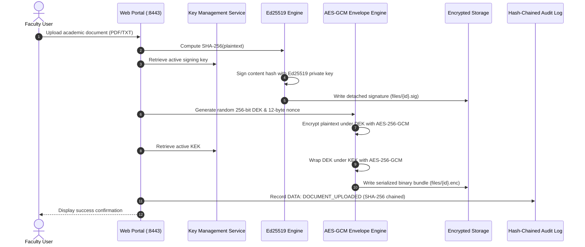
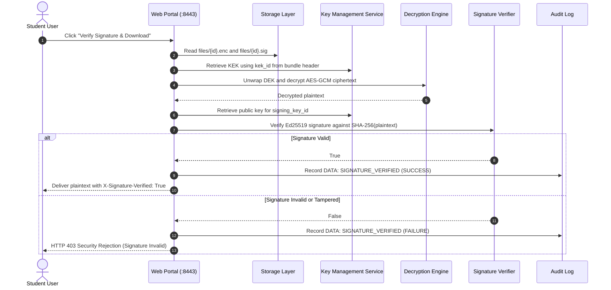
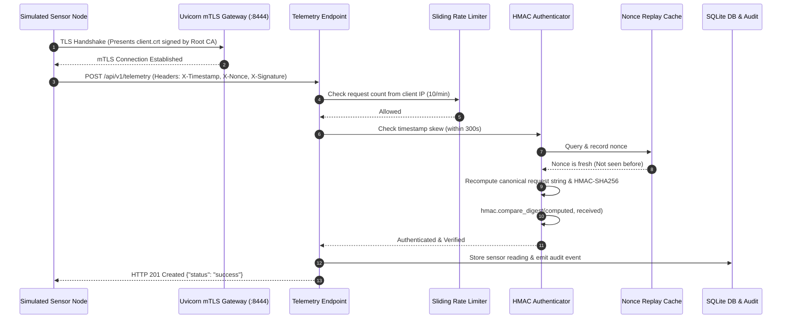

# CampusVault — Technical Architecture & Security Specifications

## 1. System Overview

**CampusVault** is an enterprise-grade secure academic web portal and IoT sensor ingest platform built in Python. Designed as a unified implementation for the HCLTech Cybersecurity Practical Assessments, it demonstrates end-to-end applied cryptography, identity management, role-based access control, secure communications, tamper-evident audit logging, and software supply chain protection.

The platform runs 100% locally on Windows 11 with Python, requires no cloud or Docker dependencies, utilizes strictly synthetic test data, loads all secrets via environment variables, and never logs sensitive material.

---

## 2. Component Architecture

```mermaid
graph TD
    subgraph Clients["Clients & Untrusted Boundaries"]
        Browser["Web Browser (Student / Faculty / Admin)"]
        SensorNode["IoT Sensor Simulator"]
        VaultCLI["VaultCTL Standalone CLI"]
    end

    subgraph PortalServer["HTTPS Portal (Port :8443)"]
        PortalApp["FastAPI Web Portal"]
        SecHeaders["Security Headers Middleware"]
        SessionMgr["Session & CSRF Engine"]
        RBAC["Role-Based Access Control"]
        PortalApp --> SecHeaders
        PortalApp --> SessionMgr
        PortalApp --> RBAC
    end

    subgraph APIServer["mTLS Telemetry API (Port :8444)"]
        APIApp["FastAPI Sensor API"]
        mTLS["mTLS Client Cert Validator"]
        RateLimiter["Sliding Window Rate Limiter"]
        HMACAuth["Canonical HMAC-SHA256 Auth"]
        NonceCache["Replay Nonce Cache"]
        APIApp --> mTLS
        APIApp --> RateLimiter
        APIApp --> HMACAuth
        HMACAuth --> NonceCache
    end

    subgraph SecurityCore["Core Cryptographic Security Services"]
        KeyService["Key Management Service (Module 8)"]
        AuditLogger["Hash-Chained Audit Ledger (Module 7)"]
        EnvEncrypt["Envelope Encryption (AES-256-GCM)"]
        DigitalSig["Digital Signatures (Ed25519)"]
        PasswordStore["Argon2id Password Storage"]
    end

    subgraph Storage["Persistent Storage Layer"]
        SQLiteDB[("SQLite Database (campusvault.db)")]
        EncFiles[("Encrypted File Vault (data/files/)")]
        PKIStore[("PKI Certificates (pki/)")]
    end

    Browser -- "HTTPS / TLS 1.3" --> PortalApp
    SensorNode -- "mTLS + HMAC-SHA256" --> APIApp
    VaultCLI -- "scrypt + AES-GCM" --> EncFiles

    PortalApp --> KeyService
    PortalApp --> AuditLogger
    PortalApp --> EnvEncrypt
    PortalApp --> DigitalSig
    PortalApp --> PasswordStore

    APIApp --> AuditLogger
    APIApp --> KeyService

    SecurityCore --> SQLiteDB
    EnvEncrypt --> EncFiles
```

---

## 3. Cryptographic Specifications

| Function | Primitive / Algorithm | Standard / Library | Parameters & Security Justification |
|---|---|---|---|
| **User Password Hashing** | Argon2id | `argon2-cffi` | `time_cost=3`, `memory_cost=65536` (64 MiB), `parallelism=4`, `hash_len=32`, `salt_len=16`. Memory-hard, ASIC-resistant. |
| **Recovery Token Hashing** | Argon2id | `argon2-cffi` | Single-use 256-bit URL-safe token, hashed before storage, 1-hour expiration. |
| **Passphrase File KDF** | scrypt | `cryptography` | `N=32768`, `r=8`, `p=1`, `length=32`, 32-byte unique salt from `os.urandom`. |
| **File Envelope Encryption** | AES-256-GCM | `cryptography` | 256-bit DEK generated via `os.urandom(32)`, 96-bit random nonce, 128-bit authentication tag. DEK wrapped under KeyService KEK. |
| **Key Storage at Rest** | AES-256-GCM | `cryptography` | Raw key bytes encrypted under `CV_MASTER_KEY` (256-bit base64), random 12-byte nonce per key. |
| **Digital Signatures** | Ed25519 | `cryptography` | High-speed, side-channel immune elliptic curve signatures over SHA-256 content hashes. Detached `.sig` JSON format. |
| **API Message Integrity** | HMAC-SHA256 | `hmac` / `hashlib` | Canonical request: `METHOD\nPATH\nTIMESTAMP\nNONCE\nSHA256(BODY)\n`. Verified with `hmac.compare_digest`. |
| **Audit Log Integrity** | SHA-256 Hash Chain | `hashlib` | Genesis record hash = 64 zeros. Each record: `SHA256(prev_hash + canonical_json(fields))`. Append-only. |
| **Transport Layer Security** | RSA 2048 / SHA-256 | `cryptography` / Uvicorn | Self-signed Root CA, SAN server certificate (`localhost`, `127.0.0.1`), mTLS client certificate (`sensor-simulator-01`). |

---

## 4. End-to-End Cryptographic Workflows

### 4.1 Document Upload & Signature Workflow

### 4.2 Document Download & Signature Verification Workflow

### 4.3 IoT Sensor Telemetry Ingestion (mTLS + HMAC-SHA256)

---

## 5. Security Principles & Threat Defenses

1. **Deny by Default:**
   - Every route requires authentication and explicit permission checks.
   - Any unknown path, unauthenticated user, or missing role is rejected immediately with generic error messages.

2. **Defense in Depth:**
   - Transport Layer: mTLS client certificates authenticate sensor hardware.
   - Application Layer: HMAC-SHA256 ensures packet-level tamper detection.
   - Network Layer: Rate limiting prevents flooding DoS attacks.
   - Storage Layer: Data at rest is encrypted with AES-256-GCM.

3. **Cryptographic Non-Repudiation & Tamper Evidence:**
   - Actions and grade ledger entries are audited into a sequential hash chain.
   - Any modification to database records breaks the SHA-256 continuity and is detected by `scripts/verify_audit.py`.

4. **Zero Secret Leakage:**
   - Passwords, session secrets, master keys, and private keys are never written to logs or displayed in error messages.
   - Audit detail strings are automatically scrubbed via regex redaction filters before storage.
