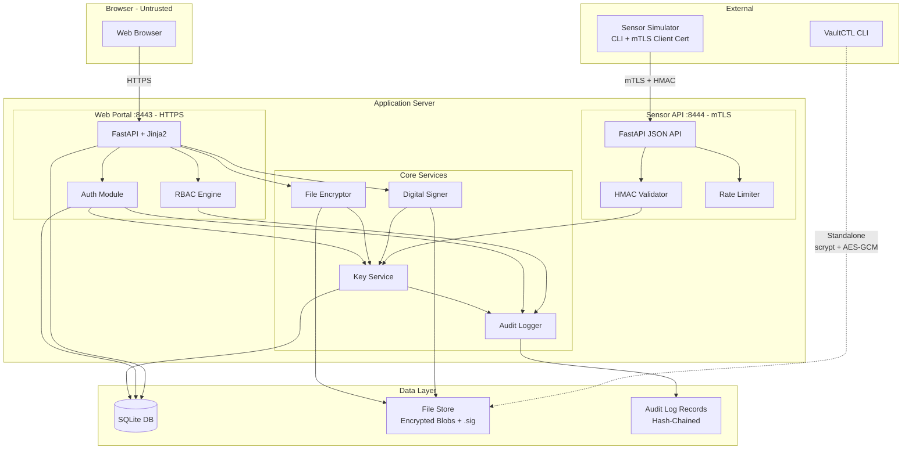
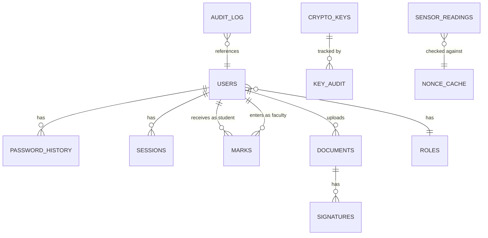

# CampusVault — Implementation Plan

> **Version:** 1.0 · **Date:** 2026-09-28  
> **Author:** Application Security Engineering  
> **Audience:** Student implementer (single developer, demo-focused)

---

## Table of Contents

1. [Final Architecture](#1-final-architecture)
2. [Repository Structure](#2-repository-structure)
3. [Data Model](#3-data-model)
4. [Module-by-Module Design](#4-module-by-module-design)
5. [Phased Build Order](#5-phased-build-order)
6. [Configuration and Secrets Strategy](#6-configuration-and-secrets-strategy)
7. [Evidence Plan](#7-evidence-plan)
8. [Documentation Plan](#8-documentation-plan)
9. [Risks, Pitfalls and Mitigations](#9-risks-pitfalls-and-mitigations)
10. [Final Submission Checklist](#10-final-submission-checklist)
11. [Open Questions](#11-open-questions)

---

## 1. Final Architecture

### 1.1 Component Overview

| Component | Description | Port |
|---|---|---|
| **Web Portal** (FastAPI + Jinja2) | Browser-facing HTTPS app: login, marks, documents, admin panel | `8443` |
| **Sensor API** (FastAPI) | mTLS-only JSON API for HMAC-signed lab readings | `8444` |
| **Key Service** | In-process Python module managing key lifecycle | Internal |
| **Audit Logger** | Append-only, hash-chained tamper-evident log writer/verifier | Internal |
| **Sensor Simulator** | CLI script that generates fake lab readings, signs with HMAC, sends via mTLS | CLI |
| **VaultCTL** | Standalone CLI for passphrase-based file encrypt/decrypt (scrypt + AES-GCM) | CLI |
| **SQLite DB** (`data/campusvault.db`) | Users, roles, marks, documents metadata, keys, sessions, audit | File |
| **File Store** (`data/files/`) | Encrypted document blobs and detached `.sig` files | Directory |
| **PKI Store** (`pki/`) | CA cert, server cert/key, client cert/key | Directory |

### 1.2 Trust Boundaries

```
┌─────────────────────────────────────────────────────────────┐
│  TRUST BOUNDARY 1: User's Browser (untrusted)              │
│  ┌──────────────┐                                           │
│  │  Browser      │─── HTTPS (port 8443) ───┐               │
│  └──────────────┘                           │               │
└─────────────────────────────────────────────│───────────────┘
                                              ▼
┌─────────────────────────────────────────────────────────────┐
│  TRUST BOUNDARY 2: Application Server (partially trusted)   │
│                                                              │
│  ┌──────────────────────┐   ┌──────────────────────┐        │
│  │  Web Portal (8443)   │   │  Sensor API (8444)   │        │
│  │  TLS (server-only)   │   │  mTLS (mutual)       │        │
│  └─────────┬────────────┘   └──────────┬───────────┘        │
│            │                           │                     │
│            ▼                           ▼                     │
│  ┌──────────────────────────────────────────────────┐       │
│  │         Shared Application Logic                  │       │
│  │  ┌────────────┐  ┌───────────┐  ┌─────────────┐ │       │
│  │  │ Key Service│  │ Audit Log │  │ RBAC Engine  │ │       │
│  │  └────────────┘  └───────────┘  └─────────────┘ │       │
│  └──────────────────────┬───────────────────────────┘       │
│                         │                                    │
│                         ▼                                    │
│  ┌──────────────────────────────────────────────────┐       │
│  │  TRUST BOUNDARY 3: Data at Rest (protected)       │       │
│  │  ┌────────────┐  ┌─────────────┐  ┌───────────┐ │       │
│  │  │ SQLite DB  │  │ File Store  │  │ Audit Logs│ │       │
│  │  │ (encrypted │  │ (AES-GCM   │  │ (hash-    │ │       │
│  │  │  keys col) │  │  blobs)     │  │  chained) │ │       │
│  │  └────────────┘  └─────────────┘  └───────────┘ │       │
│  └──────────────────────────────────────────────────┘       │
└──────────────────────────────────────────────────────────────┘

┌─────────────────────────────────────────────────────────────┐
│  TRUST BOUNDARY 4: External Sensor (semi-trusted)           │
│  ┌────────────────────┐                                     │
│  │  Sensor Simulator   │─── mTLS + HMAC (port 8444) ──►    │
│  └────────────────────┘                                     │
└─────────────────────────────────────────────────────────────┘
```

### 1.3 Mermaid Architecture Diagram



### 1.4 Data-Flow Summary

| Flow | Path | Protection |
|---|---|---|
| Login | Browser → HTTPS → Auth Module → Argon2id verify → Session cookie | TLS, Argon2id, secure cookie flags |
| View Marks | Browser → HTTPS → RBAC check → SQLite query (ownership filter) | TLS, session auth, row-level ownership |
| Upload Document | Faculty browser → HTTPS → Encrypt (AES-GCM, envelope) → Sign (Ed25519) → File Store | TLS, per-file DEK, detached signature |
| Download Document | Browser → HTTPS → Verify signature → Decrypt → Stream | Signature verified before decrypt |
| Lab Reading | Simulator → mTLS → HMAC verify → Nonce/timestamp check → DB insert | mTLS, HMAC-SHA256, replay protection |
| Key Operation | Any module → Key Service → Audit log entry | RBAC on caller, audit trail, keys encrypted at rest |
| Audit Read | Admin browser → HTTPS → RBAC check (admin only) → Hash chain verify → Display | TLS, role check, tamper detection |

---

## 2. Repository Structure

```
CampusVault/
├── .env                          # Secrets: master key, HMAC secrets, etc. (git-ignored)
├── .gitignore                    # Excludes .env, .venv, data/, pki/private/, *.db, __pycache__
├── requirements.txt              # Pinned dependencies (already present)
├── README.md                     # Setup guide, architecture overview, quick start
│
├── app/                          # Web portal (Assessment 1, 2, 3, 5)
│   ├── __init__.py               # Package marker
│   ├── main.py                   # FastAPI app factory, mount routes, startup events
│   ├── config.py                 # Settings loaded from .env via python-dotenv
│   ├── database.py               # SQLite connection helper, schema init, migrations
│   ├── models.py                 # Pydantic schemas for request/response validation
│   ├── auth.py                   # Registration, login, password policy, Argon2id, lockout, recovery
│   ├── rbac.py                   # Role-permission matrix, decorators, ownership checks
│   ├── routes_auth.py            # Login/register/logout/recovery endpoints + templates
│   ├── routes_student.py         # Student dashboard, view marks, download documents
│   ├── routes_faculty.py         # Faculty mark entry, document upload
│   ├── routes_admin.py           # Admin user management, audit log viewer, key ops
│   ├── encryption.py             # Envelope encryption: AES-GCM encrypt/decrypt using key service
│   ├── signatures.py             # Ed25519 sign/verify, detached .sig management
│   ├── session.py                # Secure session management: create, validate, expire, destroy
│   └── templates/                # Jinja2 HTML templates
│       ├── base.html             # Base layout with nav, flash messages
│       ├── login.html            # Login form
│       ├── register.html         # Registration form
│       ├── recovery.html         # Password recovery form
│       ├── student_dashboard.html
│       ├── faculty_dashboard.html
│       ├── admin_dashboard.html
│       ├── marks.html            # View/enter marks
│       ├── documents.html        # Upload/download documents
│       ├── audit_log.html        # Admin-only audit log viewer
│       ├── users.html            # Admin user management
│       └── error.html            # Generic error page (no details leaked)
│
├── api/                          # Sensor API with HMAC (Assessment 6)
│   ├── __init__.py               # Package marker
│   ├── main.py                   # FastAPI app factory for mTLS API server
│   ├── hmac_auth.py              # HMAC signature verification middleware
│   ├── rate_limiter.py           # Rate limiting using slowapi or custom implementation
│   ├── nonce_cache.py            # In-memory + DB nonce replay prevention
│   ├── routes_sensor.py          # POST /readings, GET /readings, PUT /readings/{id}
│   └── models.py                 # Pydantic schemas for sensor data
│
├── keyservice/                   # Cryptographic Key Management (Assessment 8)
│   ├── __init__.py               # Package marker
│   ├── service.py                # KeyService class: generate, wrap, unwrap, rotate, revoke
│   ├── models.py                 # Key metadata: id, purpose, state, algorithm, created, rotated
│   └── store.py                  # Encrypted key storage in SQLite (master-key wrapping)
│
├── audit/                        # Tamper-Evident Audit Logging (Assessment 7)
│   ├── __init__.py               # Package marker
│   ├── logger.py                 # AuditLogger: append record with hash chain
│   ├── verifier.py               # verify_audit(): validate entire chain integrity
│   └── models.py                 # AuditRecord: event_type, timestamp, identity, action, result, hash
│
├── vault/                        # Standalone CLI encryption tool (Assessment 2 supplement)
│   ├── __init__.py               # Package marker
│   └── vaultctl.py               # CLI: encrypt/decrypt file with passphrase (scrypt + AES-GCM)
│
├── pki/                          # PKI certificates and scripts (Assessment 4)
│   ├── generate_pki.py           # Script: create root CA, server cert, client cert
│   ├── ca.crt                    # Root CA certificate (public, checked in)
│   ├── server.crt                # Server certificate (public, checked in)
│   ├── client.crt                # Client certificate (public, checked in)
│   └── private/                  # Private keys (git-ignored)
│       ├── ca.key
│       ├── server.key
│       └── client.key
│
├── simulator/                    # Sensor simulator (Assessment 6 client)
│   ├── __init__.py               # Package marker
│   └── sensor_client.py          # Generate fake readings, HMAC-sign, send via mTLS
│
├── tests/                        # All test files (one per assessment)
│   ├── conftest.py               # Shared fixtures: test client, test DB, temp keys, cleanup
│   ├── test_01_password.py       # Assessment 1: Password storage tests
│   ├── test_02_encryption.py     # Assessment 2: File encryption tests
│   ├── test_03_signatures.py     # Assessment 3: Digital signature tests
│   ├── test_04_pki_mtls.py       # Assessment 4: PKI and mTLS tests
│   ├── test_05_rbac.py           # Assessment 5: Role-based access control tests
│   ├── test_06_hmac_api.py       # Assessment 6: HMAC API tests
│   ├── test_07_audit_log.py      # Assessment 7: Tamper-evident audit log tests
│   ├── test_08_key_mgmt.py       # Assessment 8: Key management tests
│   ├── test_09_stride.py         # Assessment 9: STRIDE implementation tests
│   └── test_10_sbom.py           # Assessment 10: SBOM and dependency tests
│
├── data/                         # Runtime data (git-ignored)
│   ├── campusvault.db            # SQLite database
│   ├── files/                    # Encrypted document blobs
│   ├── audit/                    # Audit log JSONL files
│   └── backups/                  # Key backup simulation files
│
├── docs/                         # Documentation
│   ├── IMPLEMENTATION_PLAN.md    # This file
│   ├── ARCHITECTURE.md           # Architecture diagrams and narrative
│   ├── STRIDE_WORKSHEET.md       # STRIDE threat model worksheet
│   ├── ASSESSMENT_NOTES.md       # Per-assessment implementation notes
│   └── REPORT_OUTLINE.md         # Outline for the 3-5 page final report
│
├── evidence/                     # Captured evidence for submission
│   ├── assessment_01/            # Screenshots, logs for password assessment
│   ├── assessment_02/            # Screenshots, logs for encryption assessment
│   ├── assessment_03/            # ... and so on for each assessment
│   ├── ...
│   └── assessment_10/
│
├── sbom/                         # SBOM artifacts (Assessment 10)
│   ├── sbom_before.json          # CycloneDX SBOM before remediation
│   ├── sbom_after.json           # CycloneDX SBOM after remediation
│   ├── audit_before.txt          # pip-audit output before remediation
│   └── audit_after.txt           # pip-audit output after remediation
│
├── scripts/                      # Helper scripts
│   ├── seed_data.py              # Populate DB with synthetic users, marks, documents
│   ├── run_portal.py             # Start the web portal with TLS on port 8443
│   ├── run_api.py                # Start the sensor API with mTLS on port 8444
│   └── verify_audit.py           # Convenience wrapper: invoke audit.verifier
│
└── conftest.py                   # Root-level pytest config (adds project to sys.path)
```

---

## 3. Data Model

### 3.1 Entity-Relationship Overview



### 3.2 Table Definitions

#### `users`
| Column | Type | Notes |
|---|---|---|
| `id` | TEXT (UUID) | Primary key |
| `username` | TEXT | Unique, 3-30 chars, alphanumeric + underscore |
| `email` | TEXT | Unique, validated format |
| `password_hash` | TEXT | Argon2id encoded string (includes salt + params) |
| `role` | TEXT | FK to roles.name (`student`, `faculty`, `admin`) |
| `failed_attempts` | INTEGER | Reset on successful login |
| `locked_until` | TEXT (ISO 8601) | NULL if not locked |
| `recovery_token_hash` | TEXT | Argon2id hash of recovery token, NULL if unused |
| `recovery_token_expiry` | TEXT (ISO 8601) | Expiry of recovery token |
| `created_at` | TEXT (ISO 8601) | Account creation timestamp |
| `updated_at` | TEXT (ISO 8601) | Last update timestamp |

#### `password_history`
| Column | Type | Notes |
|---|---|---|
| `id` | INTEGER | Primary key, autoincrement |
| `user_id` | TEXT | FK to users.id |
| `password_hash` | TEXT | Argon2id encoded string of previous password |
| `changed_at` | TEXT (ISO 8601) | When this password was retired |

> **Design note:** Store the last 3 entries. On password change, verify new password doesn't match any of the last 3 by running `argon2.verify()` against each stored hash.

#### `roles`
| Column | Type | Notes |
|---|---|---|
| `name` | TEXT | Primary key: `student`, `faculty`, `admin` |
| `permissions` | TEXT (JSON) | JSON array of permission strings |

**Permissions matrix (seeded data):**

| Permission | Student | Faculty | Admin |
|---|---|---|---|
| `marks:read_own` | Yes | Yes | Yes |
| `marks:read_assigned` | | Yes | Yes |
| `marks:write_assigned` | | Yes | Yes |
| `documents:download` | Yes | Yes | Yes |
| `documents:upload` | | Yes | Yes |
| `users:manage` | | | Yes |
| `audit:read` | | | Yes |
| `keys:manage` | | | Yes |
| `readings:read` | | Yes | Yes |

#### `sessions`
| Column | Type | Notes |
|---|---|---|
| `id` | TEXT (UUID) | Primary key, used as session token |
| `user_id` | TEXT | FK to users.id |
| `created_at` | TEXT (ISO 8601) | Session creation time |
| `expires_at` | TEXT (ISO 8601) | Absolute expiry (e.g., 30 min from creation) |
| `is_active` | INTEGER (0/1) | Set to 0 on logout |

> **Design note:** Session token stored in a `Secure; HttpOnly; SameSite=Strict` cookie. Token is a random UUID (via `secrets.token_urlsafe`), never the user ID itself.

#### `marks`
| Column | Type | Notes |
|---|---|---|
| `id` | INTEGER | Primary key, autoincrement |
| `student_id` | TEXT | FK to users.id (student) |
| `faculty_id` | TEXT | FK to users.id (faculty who entered) |
| `course_code` | TEXT | e.g. `CS301` |
| `course_name` | TEXT | e.g. `Network Security` |
| `score` | INTEGER | 0-100 |
| `semester` | TEXT | e.g. `Fall 2026` |
| `entered_at` | TEXT (ISO 8601) | When mark was entered |

#### `documents`
| Column | Type | Notes |
|---|---|---|
| `id` | TEXT (UUID) | Primary key |
| `filename` | TEXT | Original filename (sanitised) |
| `uploader_id` | TEXT | FK to users.id |
| `encryption_key_id` | TEXT | FK to crypto_keys.id (the DEK's wrapping key) |
| `file_path` | TEXT | Relative path under `data/files/` |
| `signature_path` | TEXT | Relative path to `.sig` file |
| `signing_key_id` | TEXT | FK to crypto_keys.id (the signing key used) |
| `content_hash` | TEXT | SHA-256 of plaintext before encryption |
| `uploaded_at` | TEXT (ISO 8601) | Upload timestamp |

#### `crypto_keys`
| Column | Type | Notes |
|---|---|---|
| `id` | TEXT (UUID) | Primary key |
| `purpose` | TEXT | `encryption` or `signing` or `hmac` |
| `algorithm` | TEXT | `AES-256-GCM`, `Ed25519`, `HMAC-SHA256` |
| `state` | TEXT | `active`, `retired`, `revoked`, `destroyed` |
| `encrypted_key_material` | BLOB | Key bytes encrypted under master key (AES-GCM) |
| `key_nonce` | BLOB | Nonce used to encrypt the key material |
| `public_key_material` | BLOB | NULL for symmetric keys; Ed25519 public bytes for signing keys |
| `created_at` | TEXT (ISO 8601) | Key creation time |
| `rotated_at` | TEXT (ISO 8601) | NULL until rotated |
| `revoked_at` | TEXT (ISO 8601) | NULL until revoked |
| `replaced_by` | TEXT | FK to crypto_keys.id (new key after rotation) |
| `created_by` | TEXT | User or system identity that created the key |

#### `nonce_cache`
| Column | Type | Notes |
|---|---|---|
| `nonce` | TEXT | Primary key, the nonce string from the HMAC request |
| `received_at` | TEXT (ISO 8601) | When the nonce was first seen |

> **Design note:** Also keep an in-memory set for fast lookup during a server run. Periodically prune entries older than the timestamp window (e.g., 5 minutes). The DB table ensures persistence across restarts.

#### `sensor_readings`
| Column | Type | Notes |
|---|---|---|
| `id` | INTEGER | Primary key, autoincrement |
| `sensor_id` | TEXT | Identifier of the simulated sensor |
| `temperature` | REAL | Simulated temperature value |
| `humidity` | REAL | Simulated humidity value |
| `timestamp` | TEXT (ISO 8601) | Reading timestamp (from sensor) |
| `received_at` | TEXT (ISO 8601) | Server receipt timestamp |

#### `audit_log`
| Column | Type | Notes |
|---|---|---|
| `id` | INTEGER | Primary key, autoincrement |
| `event_type` | TEXT | Category: `AUTH`, `KEY`, `ACCESS`, `DATA`, `SYSTEM` |
| `timestamp` | TEXT (ISO 8601) | Event time (server clock) |
| `identity` | TEXT | User ID or `SYSTEM` or sensor ID |
| `action` | TEXT | e.g., `LOGIN_SUCCESS`, `KEY_ROTATED`, `DOCUMENT_DOWNLOADED` |
| `result` | TEXT | `SUCCESS`, `FAILURE`, `DENIED` |
| `detail` | TEXT | Additional context (never contains secrets) |
| `prev_hash` | TEXT | SHA-256 of the previous record's full JSON |
| `record_hash` | TEXT | SHA-256 of this record (excluding `record_hash` field itself) |

> **Design note:** The first record uses a well-known genesis hash (e.g., 64 zero characters). Each subsequent record's `prev_hash` = the previous record's `record_hash`. This creates a verifiable hash chain.

---

## 4. Module-by-Module Design

### 4.1 Module 8 — Key Service (`keyservice/`)

**Why first:** Every other cryptographic module depends on the key service. It is the backbone.

**Public interface:**

```python
class KeyService:
    def __init__(self, master_key: bytes, db_path: str): ...

    def generate_key(self, purpose: str, algorithm: str, created_by: str) -> str:
        """Generate a new key, encrypt at rest, return key_id."""

    def get_key(self, key_id: str, caller: str) -> bytes:
        """Unwrap and return raw key bytes. Raises if revoked/destroyed."""

    def get_public_key(self, key_id: str) -> bytes:
        """Return public key bytes for signing keys."""

    def rotate_key(self, old_key_id: str, caller: str) -> str:
        """Create new key, mark old as retired, return new key_id."""

    def revoke_key(self, key_id: str, caller: str) -> None:
        """Mark key as revoked. Future get_key() calls will fail."""

    def destroy_key(self, key_id: str, caller: str) -> None:
        """Overwrite key material, mark as destroyed."""

    def backup(self, backup_path: str, caller: str) -> None:
        """Export encrypted key store to a file."""

    def restore(self, backup_path: str, caller: str) -> None:
        """Restore key store from a backup file."""

    def list_keys(self, purpose: str = None) -> list[dict]:
        """List key metadata (never raw material)."""
```

**Security decisions:**
- Master key loaded from `CV_MASTER_KEY` env var, decoded from base64. Never stored in code.
- Each key's raw bytes wrapped with AES-GCM under the master key; unique nonce per wrapping.
- Separate keys for separate purposes: never use an encryption key for signing.
- Every operation is audited via the audit logger.
- `get_key()` checks key state and raises `KeyRevoked` or `KeyDestroyed` with safe messages.

**Dependencies:** `audit/logger.py`, `app/database.py`, `app/config.py`.

---

### 4.2 Module 7 — Audit Logger (`audit/`)

**Why second:** All modules emit audit events. Must exist before anything else logs.

**Public interface:**

```python
class AuditLogger:
    def __init__(self, db_path: str): ...

    def log(self, event_type: str, identity: str, action: str,
            result: str, detail: str = "") -> None:
        """Append a hash-chained audit record."""

    def get_recent(self, limit: int = 100) -> list[dict]:
        """Return recent records (for admin UI)."""


def verify_audit(db_path: str) -> tuple[bool, list[str]]:
    """Walk the entire chain. Return (valid, list_of_errors)."""
```

**Security decisions:**
- Hash chain: each record includes `prev_hash` (previous record's `record_hash`). Genesis record uses `"0" * 64`.
- `record_hash` = SHA-256 of the canonical JSON of all fields except `record_hash` itself.
- `detail` field is scrubbed: never include passwords, keys, tokens. Only include identifiers and action descriptions.
- Log-write failure: catch `sqlite3.Error`, print a warning to stderr, but never crash the application. Queue the failed entry for retry.
- DB-level enforcement: the audit table should ideally be append-only. Since SQLite doesn't natively support this, the application never exposes DELETE/UPDATE on this table. The hash chain serves as tamper detection.
- Admin-only access via RBAC.

**Dependencies:** `app/database.py`.

---

### 4.3 Module 1 — Secure Password Storage (`app/auth.py`)

**Public interface:**

```python
def register_user(username: str, email: str, password: str, role: str) -> str:
    """Validate policy, hash with Argon2id, create user. Return user_id."""

def login(username: str, password: str) -> Session:
    """Verify password, check lockout, create session. Raise on failure."""

def change_password(user_id: str, old_password: str, new_password: str) -> None:
    """Verify old, check history (last 3), hash new, store."""

def initiate_recovery(email: str) -> None:
    """Generate time-limited recovery token, hash and store it."""

def complete_recovery(token: str, new_password: str) -> None:
    """Verify token, enforce policy, reset password."""

def check_password_policy(password: str) -> list[str]:
    """Return list of policy violations (empty = valid)."""
```

**Password policy:**
- Minimum 12 characters.
- At least 1 uppercase, 1 lowercase, 1 digit, 1 special character.
- Not in a blocklist of common passwords (small embedded list).

**Argon2id parameters:** Use `argon2-cffi` defaults (which are strong): `time_cost=3`, `memory_cost=65536 (64 MiB)`, `parallelism=4`. The library auto-generates a random salt and encodes salt+params into the hash string.

**Lockout:** 5 failed attempts leads to account locked for 15 minutes (`locked_until` column). Reset counter on successful login.

**Password history:** On change, push old hash to `password_history`. Before accepting new password, verify it against the last 3 history entries using `argon2.verify()`.

**Recovery flow:** Generate a `secrets.token_urlsafe(32)` token, hash it with Argon2id, store hash + expiry (1 hour). User enters token on recovery page. Stateless — no email actually sent (synthetic data constraint).

**Security decisions:**
- Never reveal whether a username exists (generic "invalid credentials" message).
- Log `LOGIN_SUCCESS`, `LOGIN_FAILURE`, `ACCOUNT_LOCKED`, `PASSWORD_CHANGED` to audit.
- Never log the password itself.

**Dependencies:** `keyservice/` (not directly, but auth events are audited), `audit/logger.py`, `app/database.py`.

---

### 4.4 Module 5 — Role-Based Access Control (`app/rbac.py`)

**Public interface:**

```python
def require_role(*roles: str) -> Callable:
    """FastAPI dependency/decorator. Deny if user's role not in list."""

def require_permission(permission: str) -> Callable:
    """FastAPI dependency. Check permission against role matrix."""

def check_ownership(user_id: str, resource_owner_id: str) -> bool:
    """Return True if user owns the resource. Used for marks, etc."""

def get_session(request: Request) -> Session:
    """Extract and validate session from cookie. Raise 401 if invalid/expired."""
```

**Security decisions:**
- Deny-by-default: every route must explicitly declare required role/permission.
- Server-side enforcement only. Never rely on hidden buttons or client-side checks.
- Ownership check: students can only see marks where `student_id == their user_id`.
- Session expiry: 30 minutes from creation. No sliding window (simpler).
- On access denied: return HTTP 403 with generic message. Log the attempt to audit.
- On expired/missing session: return HTTP 401, redirect to login.

**Dependencies:** `app/session.py`, `app/database.py`, `audit/logger.py`.

---

### 4.5 Module 2 — Authenticated File Encryption (`app/encryption.py`, `vault/vaultctl.py`)

**Public interface (app/encryption.py):**

```python
def encrypt_file(plaintext: bytes, uploader_id: str) -> EncryptedFile:
    """Envelope encrypt: generate DEK, encrypt data, wrap DEK with key-service key.
    Return EncryptedFile(ciphertext, nonce, tag, wrapped_dek, key_id)."""

def decrypt_file(encrypted: EncryptedFile) -> bytes:
    """Unwrap DEK, decrypt data, verify GCM tag. Raise on failure."""
```

**Public interface (vault/vaultctl.py):**

```python
# CLI commands:
# python -m vault.vaultctl encrypt --input FILE --output FILE --passphrase PROMPT
# python -m vault.vaultctl decrypt --input FILE --output FILE --passphrase PROMPT
```

**Envelope encryption scheme:**
1. Generate a random 256-bit Data Encryption Key (DEK) via `os.urandom(32)`.
2. Encrypt plaintext with AES-256-GCM using the DEK + random 96-bit nonce.
3. Request the key service for the current active encryption key (the Key Encryption Key, KEK).
4. Wrap (encrypt) the DEK under the KEK using AES-GCM with a separate nonce.
5. Store: `[wrapped_dek | dek_nonce | kek_key_id | data_nonce | ciphertext | tag]`.
6. On decrypt: unwrap DEK using key service, then decrypt data, verify tag.

**VaultCTL standalone scheme:**
1. Derive a 256-bit key from passphrase using scrypt (N=2^20, r=8, p=1, 32-byte salt from `os.urandom`).
2. Encrypt with AES-256-GCM (random 96-bit nonce).
3. Output format: `[salt(32) | nonce(12) | ciphertext | tag(16)]`.

**Security decisions:**
- Never reuse nonces: always `os.urandom(12)` for each encryption.
- Verify GCM authentication tag before returning any plaintext.
- If tag verification fails, raise a generic `IntegrityError`. Never return partial plaintext.
- Never use ECB mode. Never hard-code keys.
- Encrypting the same plaintext twice produces different output (due to random DEK and nonce).

**Dependencies:** `keyservice/service.py`, `audit/logger.py`.

---

### 4.6 Module 3 — Digital Signatures (`app/signatures.py`)

**Public interface:**

```python
def sign_file(plaintext: bytes, signer_id: str) -> SignatureBundle:
    """SHA-256 hash then Ed25519 sign. Return SignatureBundle(signature, key_id, content_hash)."""

def verify_signature(plaintext: bytes, signature: bytes, key_id: str) -> bool:
    """Verify Ed25519 signature. Return True/False. Never raise on invalid sig."""

def save_detached_signature(bundle: SignatureBundle, doc_id: str) -> str:
    """Write .sig file alongside document. Return file path."""

def load_detached_signature(doc_id: str) -> SignatureBundle:
    """Load .sig file. Raise FileNotFoundError if missing (handled by caller)."""
```

**Scheme:**
1. Compute `content_hash = SHA-256(plaintext)`.
2. Sign `content_hash` with Ed25519 private key from key service.
3. Store as detached `.sig` file (JSON: `{signature_hex, key_id, content_hash_hex, signed_at}`).
4. On download: load `.sig`, retrieve public key from key service, verify signature.
5. If signature missing or invalid: deny download, return safe error, log to audit.

**Security decisions:**
- Sign the plaintext before encryption. Verify signature on plaintext after decryption.
- Detached signatures stored separately so they can be verified independently.
- If the signing key has been revoked, warn but still allow verification of old signatures (the key service should return the public key even for revoked signing keys, since verification is not the same as signing).
- Never expose the private signing key in logs or responses.

**Dependencies:** `keyservice/service.py`, `audit/logger.py`.

---

### 4.7 Module 4 — PKI and Mutual TLS (`pki/`)

**Public interface:**

```python
# pki/generate_pki.py — run once to set up certificates
def generate_ca() -> tuple[Certificate, PrivateKey]:
    """Create self-signed root CA (RSA-2048). Validity: 365 days."""

def generate_server_cert(ca_cert, ca_key) -> tuple[Certificate, PrivateKey]:
    """Server cert for localhost/127.0.0.1. Validity: 90 days."""

def generate_client_cert(ca_cert, ca_key, common_name: str) -> tuple[Certificate, PrivateKey]:
    """Client cert for sensor simulator. Validity: 90 days."""
```

**Certificate details:**
- Root CA: `CN=CampusVault Root CA`, self-signed, `basicConstraints: CA:TRUE`.
- Server cert: `CN=localhost`, SAN: `DNS:localhost, IP:127.0.0.1`. Signed by CA.
- Client cert: `CN=sensor-simulator-01`. Signed by CA. Used for mTLS.
- All certs use RSA 2048-bit keys (broad compatibility; Ed25519 certs have TLS client support issues on some platforms).

**Uvicorn configuration:**
- **Web portal (8443):** `ssl_keyfile`, `ssl_certfile` for server TLS only. No client cert required.
- **Sensor API (8444):** `ssl_keyfile`, `ssl_certfile`, `ssl_ca_certs` (CA cert), `ssl_cert_reqs=ssl.CERT_REQUIRED` for mutual TLS.

**Security decisions:**
- Never disable certificate validation in production code. Tests may use a test CA.
- Check hostname in server cert (Uvicorn/httpx do this by default).
- Check expiry (the `cryptography` library does this automatically).
- Store private keys in `pki/private/` which is git-ignored.
- Use `icacls` to restrict private key file permissions (see section 6).

**Dependencies:** None (standalone script). Used by `scripts/run_portal.py`, `scripts/run_api.py`, `simulator/sensor_client.py`.

---

### 4.8 Module 6 — Secure API with HMAC (`api/`)

**HMAC signing scheme:**

The canonical request string:
```
METHOD\n
PATH\n
TIMESTAMP\n
NONCE\n
SHA256(BODY)\n
```

Signature = `HMAC-SHA256(canonical_string, shared_secret)`.

**Request headers:**
```
X-Timestamp: <ISO 8601>
X-Nonce: <UUID4>
X-Signature: <hex HMAC>
X-Key-Id: <key_id from key service>
```

**Server-side verification (`api/hmac_auth.py`):**
1. Extract headers.
2. Reject if `X-Timestamp` is older than 5 minutes (clock skew protection).
3. Reject if `X-Nonce` exists in the nonce cache (replay protection).
4. Reconstruct canonical string from the actual request.
5. Retrieve the HMAC key from key service using `X-Key-Id`.
6. Compute HMAC and compare using `hmac.compare_digest()` (constant-time).
7. On success: add nonce to cache, proceed.
8. On failure: return HTTP 401 with generic message.

**Rate limiting (`api/rate_limiter.py`):**
- Use `slowapi` with a limit of e.g., `10/minute` per client IP.
- On limit exceeded: return HTTP 429 with `Retry-After` header.

**Endpoints:**
- `POST /api/readings` — Submit a new sensor reading.
- `GET /api/readings` — List recent readings (faculty/admin only via HMAC key scope).
- `PUT /api/readings/{id}` — Update a reading (admin only).

**Security decisions:**
- Shared HMAC secret stored in `.env` or managed by key service.
- Use `hmac.compare_digest()` — never `==` for signature comparison.
- Nonce cache pruned periodically (entries older than 5 minutes).
- Input validation via Pydantic models (temperature: float, humidity: float, etc.).

**Dependencies:** `keyservice/service.py`, `audit/logger.py`, `api/nonce_cache.py`.

---

### 4.9 Module 9 — STRIDE Secure Implementation (`docs/STRIDE_WORKSHEET.md`)

This is primarily a **documentation and analysis** module, but it requires demonstrable controls in code.

**Deliverables:**
1. Architecture + data-flow diagram with labelled trust boundaries (reuse section 1 diagrams).
2. STRIDE worksheet: one row per threat, columns: Component, Trust Boundary, STRIDE Category, Threat Description, Likelihood, Impact, Control, Test Case, Status.
3. At least 5 threats identified, at least 3 with implemented controls.

**Required threats and controls:**

| # | STRIDE | Threat | Control | Test |
|---|---|---|---|---|
| T1 | **S**poofing | Attacker logs in as another user | Argon2id password verification, session tokens | `test_09`: spoofed identity blocked |
| T2 | **T**ampering | Attacker modifies sensor reading in transit | HMAC signature on all API requests | `test_09`: modified message blocked |
| T3 | **R**epudiation | User denies performing an action | Tamper-evident audit log with hash chain | (covered by `test_07`) |
| T4 | **I**nformation Disclosure | Attacker reads documents from disk | AES-GCM envelope encryption at rest | (covered by `test_02`) |
| T5 | **D**enial of Service | Attacker floods sensor API | Rate limiting via slowapi | `test_09`: excessive requests trigger limit |
| T6 | **E**levation of Privilege | Student accesses admin panel | RBAC with deny-by-default, server-side enforcement | `test_09`: unauthorized admin action blocked |
| T7 | **T**ampering | Attacker modifies audit log entries | Hash-chained audit log, verification utility | (covered by `test_07`) |

**Threat-Control-Test traceability matrix:**
Map every threat to its control (code module + function) and its test case. This matrix is written in the STRIDE worksheet document.

**Before/after evidence:**
- "Before": Show a vulnerability scenario (e.g., student can access `/admin` without RBAC in a dummy route).
- "After": Show the same request being denied after RBAC is applied.

**Dependencies:** All other modules (this is analysis on top of them).

---

### 4.10 Module 10 — SBOM and Dependency Assessment (`sbom/`)

**Workflow:**

1. **Prepare deliberately outdated dependency:**
   - In `requirements.txt`, pin one legitimate package to a known-vulnerable older version.
   - Suggestion: pin `Jinja2==3.1.2` (has known CVE) or `urllib3==1.26.5` (has known CVEs).
   - The specific choice depends on what `pip-audit` reports at implementation time.

2. **Generate initial SBOM:**
   ```powershell
   python -m cyclonedx_py requirements -i requirements.txt -o sbom/sbom_before.json --format json
   ```

3. **Run initial audit:**
   ```powershell
   pip-audit -r requirements.txt -o sbom/audit_before.txt -f columns
   ```

4. **Remediate:** Update the outdated dependency to the latest secure version.

5. **Re-generate and re-audit:**
   ```powershell
   python -m cyclonedx_py requirements -i requirements.txt -o sbom/sbom_after.json --format json
   pip-audit -r requirements.txt -o sbom/audit_after.txt -f columns
   ```

6. **Compare:** Document the before/after in evidence.

**Security decisions:**
- Never hand-edit the SBOM JSON.
- Always regenerate from `requirements.txt`.
- The lock file IS `requirements.txt` (pip freeze output, already present).
- Verify that every component in the SBOM traces back to the lock file.

**Dependencies:** None (tooling-only).

---

## 5. Phased Build Order

### Phase 0 — Foundation (Days 1-2)

**Goal:** Project skeleton, database, configuration, and shared utilities.

| Task | Files | Acceptance Criteria |
|---|---|---|
| Create `app/config.py` — load `.env` via `python-dotenv` | `app/config.py` | `settings.MASTER_KEY` returns bytes |
| Create `app/database.py` — SQLite init, schema creation | `app/database.py` | All tables created on first run |
| Create `conftest.py` and `tests/conftest.py` — shared fixtures | `conftest.py`, `tests/conftest.py` | `pytest` discovers test files |
| Create `app/__init__.py` and other package markers | All `__init__.py` files | Packages importable |
| Verify `.gitignore` covers all sensitive paths | `.gitignore` | `data/`, `.env`, `pki/private/`, `*.db` excluded |

**Test cases:** None yet (infrastructure only). Run `pytest --co` to verify test collection works.

---

### Phase 1 — Key Service + Audit Logger (Days 3-5)

**Goal:** The two foundational services that all other modules depend on.

| Task | Files | Acceptance Criteria |
|---|---|---|
| Implement `keyservice/store.py` — encrypted key persistence | `keyservice/store.py` | Keys stored encrypted in DB |
| Implement `keyservice/service.py` — full KeyService class | `keyservice/service.py` | generate, get, rotate, revoke, destroy, backup, restore |
| Implement `keyservice/models.py` — key metadata models | `keyservice/models.py` | Pydantic models validate correctly |
| Implement `audit/logger.py` — hash-chained append | `audit/logger.py` | Records appended with valid hash chain |
| Implement `audit/verifier.py` — chain verification | `audit/verifier.py` | Detects tampered/deleted/reordered records |
| Implement `audit/models.py` — audit record models | `audit/models.py` | AuditRecord with all required fields |
| Write `test_08_key_mgmt.py` | `tests/test_08_key_mgmt.py` | All 5 key management test cases pass |
| Write `test_07_audit_log.py` | `tests/test_07_audit_log.py` | All 5 audit log test cases pass |

**Test cases that must pass:**

Assessment 8 (Key Management):
- Unauthorized key request denied
- Revoked key rejected
- After rotation, old data still readable (via retired key)
- Corrupt key store fails in a controlled way
- Restoring backup succeeds

Assessment 7 (Audit Log):
- Modified entry detected
- Deleted middle entry breaks chain
- Reordered entries detected
- Forged inserted entry fails verification
- Unauthorized log access denied

---

### Phase 2 — Authentication + RBAC (Days 6-8)

**Goal:** User registration, login, password policy, sessions, and role enforcement.

| Task | Files | Acceptance Criteria |
|---|---|---|
| Implement `app/auth.py` — Argon2id register/login/change/recovery | `app/auth.py` | Passwords hashed with Argon2id, policy enforced |
| Implement `app/session.py` — session create/validate/expire/destroy | `app/session.py` | Sessions expire after 30 min |
| Implement `app/rbac.py` — role matrix, decorators, ownership | `app/rbac.py` | Deny-by-default enforced |
| Implement `app/models.py` — Pydantic request/response schemas | `app/models.py` | Validation works |
| Implement `app/routes_auth.py` — login/register/logout/recovery | `app/routes_auth.py` | Auth flows work end-to-end |
| Create templates: `login.html`, `register.html`, `recovery.html`, `error.html`, `base.html` | `app/templates/` | Pages render correctly |
| Create `scripts/seed_data.py` — populate synthetic users and roles | `scripts/seed_data.py` | 3 users (1 per role) seeded |
| Write `test_01_password.py` | `tests/test_01_password.py` | All 5 password test cases pass |
| Write `test_05_rbac.py` | `tests/test_05_rbac.py` | All 5 RBAC test cases pass |

**Test cases that must pass:**

Assessment 1 (Password):
- Correct login succeeds
- Wrong password rejected
- Same password for two users gives different stored hashes
- Reusing one of last 3 passwords rejected
- Repeated failures lock the account

Assessment 5 (RBAC):
- Student views own record allowed
- Student views peer record denied
- Student opening admin route denied
- Protected URL without login denied
- Expired session forces re-authentication

---

### Phase 3 — Encryption + Signatures + Documents (Days 9-11)

**Goal:** File upload/download with envelope encryption and Ed25519 signatures.

| Task | Files | Acceptance Criteria |
|---|---|---|
| Implement `app/encryption.py` — envelope encrypt/decrypt | `app/encryption.py` | Encrypt/decrypt round-trip works |
| Implement `app/signatures.py` — Ed25519 sign/verify | `app/signatures.py` | Sign/verify round-trip works |
| Implement `vault/vaultctl.py` — standalone CLI | `vault/vaultctl.py` | CLI encrypt/decrypt works |
| Implement `app/routes_faculty.py` — mark entry, doc upload | `app/routes_faculty.py` | Faculty can upload encrypted+signed docs |
| Implement `app/routes_student.py` — view marks, download docs | `app/routes_student.py` | Students download verified docs |
| Create templates: `faculty_dashboard.html`, `student_dashboard.html`, `marks.html`, `documents.html` | `app/templates/` | Pages render correctly |
| Write `test_02_encryption.py` | `tests/test_02_encryption.py` | All 5 encryption test cases pass |
| Write `test_03_signatures.py` | `tests/test_03_signatures.py` | All 5 signature test cases pass |

**Test cases that must pass:**

Assessment 2 (Encryption):
- Valid key decrypts
- Wrong key rejected
- Modified ciphertext detected
- Modified tag fails
- Encrypting twice gives different outputs

Assessment 3 (Signatures):
- Original file valid
- Modified file invalid
- Wrong public key fails
- Replaced signature fails
- Missing signature safely rejected

---

### Phase 4 — PKI + mTLS + Sensor API (Days 12-14)

**Goal:** Certificate generation, HTTPS/mTLS configuration, HMAC-authenticated sensor API.

| Task | Files | Acceptance Criteria |
|---|---|---|
| Implement `pki/generate_pki.py` — CA, server, client certs | `pki/generate_pki.py` | Certs generated to `pki/` |
| Implement `scripts/run_portal.py` — Uvicorn with TLS | `scripts/run_portal.py` | Portal accessible at `https://localhost:8443` |
| Implement `scripts/run_api.py` — Uvicorn with mTLS | `scripts/run_api.py` | API requires client cert on 8444 |
| Implement `api/hmac_auth.py` — HMAC verification | `api/hmac_auth.py` | HMAC verified with constant-time compare |
| Implement `api/nonce_cache.py` — replay prevention | `api/nonce_cache.py` | Duplicate nonces rejected |
| Implement `api/rate_limiter.py` — rate limiting | `api/rate_limiter.py` | Excess requests get HTTP 429 |
| Implement `api/routes_sensor.py` — CRUD endpoints | `api/routes_sensor.py` | POST/GET/PUT work with HMAC |
| Implement `api/main.py` — API app factory | `api/main.py` | API server starts cleanly |
| Implement `simulator/sensor_client.py` — sensor simulator | `simulator/sensor_client.py` | Sends HMAC-signed readings via mTLS |
| Write `test_04_pki_mtls.py` | `tests/test_04_pki_mtls.py` | All 5 PKI test cases pass |
| Write `test_06_hmac_api.py` | `tests/test_06_hmac_api.py` | All 5 HMAC API test cases pass |

**Test cases that must pass:**

Assessment 4 (PKI/mTLS):
- Trusted server cert connects
- Untrusted issuer fails
- Expired cert fails
- Wrong hostname fails
- Missing client cert fails on mTLS

Assessment 6 (HMAC API):
- Valid signed request accepted
- Body changed after signing rejected
- Reused nonce rejected
- Expired timestamp rejected
- Rate limit exceeded gives controlled response

---

### Phase 5 — Admin Panel + Integration (Days 15-16)

**Goal:** Admin routes, full app integration, and web portal app factory.

| Task | Files | Acceptance Criteria |
|---|---|---|
| Implement `app/routes_admin.py` — user mgmt, audit viewer, key ops | `app/routes_admin.py` | Admin can manage users, view logs, rotate keys |
| Create templates: `admin_dashboard.html`, `audit_log.html`, `users.html` | `app/templates/` | Pages render correctly |
| Implement `app/main.py` — full app factory, mount all routes | `app/main.py` | Portal starts, all routes mounted |
| Implement `scripts/verify_audit.py` — CLI audit verification | `scripts/verify_audit.py` | Verifies hash chain from CLI |
| End-to-end integration test: login then upload then download then verify | Manual | Full workflow works |

---

### Phase 6 — STRIDE Analysis + SBOM (Days 17-18)

**Goal:** Threat modelling documentation, SBOM generation, and dependency audit.

| Task | Files | Acceptance Criteria |
|---|---|---|
| Write `docs/STRIDE_WORKSHEET.md` — full STRIDE analysis | `docs/STRIDE_WORKSHEET.md` | 5+ threats, 3+ controls, traceability matrix |
| Capture before/after evidence for STRIDE | `evidence/assessment_09/` | Screenshots showing control effectiveness |
| Pin one outdated dependency in `requirements.txt` | `requirements.txt` | pip-audit reports a finding |
| Generate SBOM before | `sbom/sbom_before.json` | Valid CycloneDX JSON |
| Run pip-audit before | `sbom/audit_before.txt` | Findings documented |
| Remediate the dependency | `requirements.txt` | Updated to secure version |
| Regenerate SBOM + re-audit after | `sbom/sbom_after.json`, `sbom/audit_after.txt` | Findings resolved |
| Write `test_09_stride.py` | `tests/test_09_stride.py` | All 5 STRIDE test cases pass |
| Write `test_10_sbom.py` | `tests/test_10_sbom.py` | All 5 SBOM test cases pass |

**Test cases that must pass:**

Assessment 9 (STRIDE):
- Normal operation works
- Spoofed identity blocked by authentication
- Modified message blocked by integrity check
- Excessive requests trigger rate limit
- Unauthorized admin action blocked

Assessment 10 (SBOM):
- SBOM file generated
- Lock file components traceable to SBOM
- Initial scan findings recorded
- Component update keeps the build working
- Re-scan compared with initial one

---

### Phase 7 — Documentation + Evidence + Polish (Days 19-20)

**Goal:** Complete all documentation, capture evidence, write report outline.

| Task | Files | Acceptance Criteria |
|---|---|---|
| Write `README.md` — setup guide + quick start | `README.md` | A new user can set up and run in under 10 minutes |
| Write `docs/ARCHITECTURE.md` — diagrams + narrative | `docs/ARCHITECTURE.md` | Clear, matches implementation |
| Write `docs/ASSESSMENT_NOTES.md` — per-assessment notes | `docs/ASSESSMENT_NOTES.md` | Covers all 10 assessments |
| Write `docs/REPORT_OUTLINE.md` — 3-5 page report outline | `docs/REPORT_OUTLINE.md` | All sections outlined |
| Capture all evidence (section 7) | `evidence/assessment_01/` through `evidence/assessment_10/` | All required evidence present |
| Final `pytest` run — all tests green | All test files | 50 tests passing |
| Run final submission checklist (section 10) | — | All items checked |

---

## 6. Configuration and Secrets Strategy

### 6.1 Environment Variables (`.env`)

```dotenv
# Master key for encrypting key-service keys at rest (base64-encoded 32 bytes)
CV_MASTER_KEY=ix-Gw2PxCMREdNgCK5gAwsiAF0OPlFG1ZX8VnlLrH4Q=

# HMAC shared secret for sensor API (base64-encoded 32 bytes)
CV_HMAC_SECRET=<generate with python one-liner below>

# Database path
CV_DB_PATH=data/campusvault.db

# Session secret for cookie signing
CV_SESSION_SECRET=<generate with python one-liner below>

# Server ports
CV_PORTAL_PORT=8443
CV_API_PORT=8444

# PKI paths
CV_CA_CERT=pki/ca.crt
CV_SERVER_CERT=pki/server.crt
CV_SERVER_KEY=pki/private/server.key
CV_CLIENT_CERT=pki/client.crt
CV_CLIENT_KEY=pki/private/client.key

# Rate limit
CV_RATE_LIMIT=10/minute

# Audit log path
CV_AUDIT_DB=data/campusvault.db

# HMAC timestamp tolerance (seconds)
CV_HMAC_TOLERANCE=300
```

### 6.2 Loading Strategy

```python
# app/config.py (sketch)
from dotenv import load_dotenv
import os, base64

load_dotenv()  # loads from .env in project root

class Settings:
    MASTER_KEY: bytes = base64.urlsafe_b64decode(os.environ["CV_MASTER_KEY"])
    HMAC_SECRET: bytes = base64.urlsafe_b64decode(os.environ["CV_HMAC_SECRET"])
    DB_PATH: str = os.getenv("CV_DB_PATH", "data/campusvault.db")
    SESSION_SECRET: str = os.environ["CV_SESSION_SECRET"]
    # ... etc
```

### 6.3 File Permissions (Windows `icacls`)

Run these after generating PKI keys:

```powershell
# Restrict private key directory to current user only
icacls "pki\private" /inheritance:r /grant:r "%USERNAME%:(OI)(CI)F"

# Restrict .env to current user only
icacls ".env" /inheritance:r /grant:r "%USERNAME%:(OI)(CI)F"

# Restrict data directory
icacls "data" /inheritance:r /grant:r "%USERNAME%:(OI)(CI)F"
```

Document these commands in the README.

### 6.4 `.gitignore` Rules

The existing `.gitignore` is mostly complete. Ensure it also covers:

```gitignore
.venv/
.env
data/
*.db
pki/*.key
pki/private/
__pycache__/
evidence/
sbom/
*.pyc
.pytest_cache/
```

### 6.5 Key Generation Helpers

Provide a small script or README section that generates initial secrets:

```powershell
# Generate CV_MASTER_KEY
python -c "import secrets,base64; print('CV_MASTER_KEY=' + base64.urlsafe_b64encode(secrets.token_bytes(32)).decode())"

# Generate CV_HMAC_SECRET
python -c "import secrets,base64; print('CV_HMAC_SECRET=' + base64.urlsafe_b64encode(secrets.token_bytes(32)).decode())"

# Generate CV_SESSION_SECRET
python -c "import secrets; print('CV_SESSION_SECRET=' + secrets.token_urlsafe(32))"
```

---

## 7. Evidence Plan

### Per-Assessment Evidence

#### Assessment 1 — Secure Password Storage
| Evidence | How to capture | Masking |
|---|---|---|
| Screenshot: registration with policy feedback | Browser screenshot of registration form showing policy errors | None needed |
| DB extract: two users same password gives different hashes | `sqlite3 data/campusvault.db "SELECT username, password_hash FROM users"` | Show only first 20 chars of hash |
| Screenshot: lockout after 5 failed attempts | Browser screenshot showing "account locked" message | None needed |
| DB extract: password_history table | `sqlite3 ... "SELECT user_id, substr(password_hash,1,20), changed_at FROM password_history"` | Truncate hash |
| Test output: `pytest tests/test_01_password.py -v` | Terminal screenshot | None needed |

#### Assessment 2 — Authenticated File Encryption
| Evidence | How to capture | Masking |
|---|---|---|
| Screenshot: encrypted file on disk (hex dump) | `python -c "print(open('data/files/xxx.enc','rb').read()[:128].hex())"` | None (it's ciphertext) |
| Screenshot: two encryptions of same file produce different outputs | Compare hex of two ciphertext files | None |
| Screenshot: VaultCTL encrypt/decrypt round-trip | Terminal screenshot | None needed |
| DB extract: documents table showing key_id | `sqlite3 ... "SELECT id, filename, encryption_key_id FROM documents"` | None |
| Test output: `pytest tests/test_02_encryption.py -v` | Terminal screenshot | None needed |

#### Assessment 3 — Digital Signatures
| Evidence | How to capture | Masking |
|---|---|---|
| Screenshot: .sig file content | `type data\files\xxx.sig` | None (it's a signature) |
| Screenshot: successful download with verified signature | Browser screenshot | None |
| Screenshot: modified file causes verification failure | Terminal or browser showing error | None |
| Test output: `pytest tests/test_03_signatures.py -v` | Terminal screenshot | None needed |

#### Assessment 4 — PKI and Mutual TLS
| Evidence | How to capture | Masking |
|---|---|---|
| Screenshot: CA cert details | `openssl x509 -in pki/ca.crt -text` or Python equivalent | None |
| Screenshot: browser HTTPS connection to portal | Browser showing lock icon on `https://localhost:8443` | None |
| Screenshot: sensor simulator connecting via mTLS | Terminal output showing successful mTLS connection | None |
| Screenshot: connection rejected without client cert | Terminal output showing SSL error | None |
| Test output: `pytest tests/test_04_pki_mtls.py -v` | Terminal screenshot | None needed |

#### Assessment 5 — Role-Based Access Control
| Evidence | How to capture | Masking |
|---|---|---|
| Screenshot: student sees own marks | Browser screenshot | Use synthetic names |
| Screenshot: student denied access to peer marks | Browser screenshot showing 403 | None |
| Screenshot: student denied access to admin panel | Browser screenshot showing 403 | None |
| Screenshot: expired session redirects to login | Browser screenshot | None |
| DB extract: roles and permissions | `sqlite3 ... "SELECT * FROM roles"` | None |
| Test output: `pytest tests/test_05_rbac.py -v` | Terminal screenshot | None needed |

#### Assessment 6 — Secure API with HMAC
| Evidence | How to capture | Masking |
|---|---|---|
| Screenshot: sensor simulator sending signed request | Terminal output | Mask HMAC secret if visible |
| Screenshot: replayed nonce rejected | Terminal output showing 401 | None |
| Screenshot: expired timestamp rejected | Terminal output showing 401 | None |
| Screenshot: rate limit triggered (429) | Terminal output or `curl` showing 429 | None |
| Test output: `pytest tests/test_06_hmac_api.py -v` | Terminal screenshot | None needed |

#### Assessment 7 — Tamper-Evident Audit Logging
| Evidence | How to capture | Masking |
|---|---|---|
| DB extract: audit log showing hash chain | `sqlite3 ... "SELECT id, event_type, action, substr(record_hash,1,16) FROM audit_log LIMIT 10"` | Truncate hashes for readability |
| Screenshot: verify_audit passes on clean log | Terminal output of `python scripts/verify_audit.py` | None |
| Screenshot: verify_audit detects tampering | Manually modify a record, re-run verifier | None |
| Screenshot: admin viewing audit log in portal | Browser screenshot | Use synthetic identities |
| Test output: `pytest tests/test_07_audit_log.py -v` | Terminal screenshot | None needed |

#### Assessment 8 — Cryptographic Key Management
| Evidence | How to capture | Masking |
|---|---|---|
| DB extract: crypto_keys table (metadata only) | `sqlite3 ... "SELECT id, purpose, state, algorithm, created_at FROM crypto_keys"` | Never show key material |
| Screenshot: key rotation in admin panel | Browser screenshot | None |
| Screenshot: revoked key rejection | Terminal output from test | None |
| Screenshot: backup/restore success | Terminal output | Mask file paths if needed |
| Test output: `pytest tests/test_08_key_mgmt.py -v` | Terminal screenshot | None needed |

#### Assessment 9 — STRIDE Secure Implementation
| Evidence | How to capture | Masking |
|---|---|---|
| STRIDE worksheet document | `docs/STRIDE_WORKSHEET.md` | None |
| Architecture diagram with trust boundaries | Mermaid diagram in docs | None |
| Before screenshot: unprotected route accessible | Browser or terminal | None |
| After screenshot: same route denied by RBAC | Browser or terminal | None |
| Threat-control-test traceability matrix | Table in STRIDE worksheet | None |
| Test output: `pytest tests/test_09_stride.py -v` | Terminal screenshot | None needed |

#### Assessment 10 — SBOM and Dependency Assessment
| Evidence | How to capture | Masking |
|---|---|---|
| `sbom/sbom_before.json` | Generated file | None |
| `sbom/audit_before.txt` | pip-audit output | None |
| `sbom/sbom_after.json` | Generated file | None |
| `sbom/audit_after.txt` | pip-audit output | None |
| Side-by-side comparison of before/after | Diff output or table | None |
| Test output: `pytest tests/test_10_sbom.py -v` | Terminal screenshot | None needed |

### Masking Rules
- **Never** include real passwords, master keys, HMAC secrets, or private keys in evidence.
- **Truncate** password hashes to first 20 characters in any DB extract.
- **Use synthetic data** for all usernames, emails, marks (e.g., `alice_student`, `bob_faculty`, `carol_admin`).
- **Redact** the `.env` file if shown (replace values with `<REDACTED>`).

---

## 8. Documentation Plan

### 8.1 README.md

**Sections:**
1. **Project Overview** — What CampusVault is, what it demonstrates.
2. **Architecture Overview** — Brief description + link to full architecture doc.
3. **Prerequisites** — Python 3.12, Windows 11, OpenSSL (for cert inspection, not required for generation).
4. **Quick Start**
   - Clone repo
   - `python -m venv .venv && .venv\Scripts\Activate.ps1`
   - `pip install -r requirements.txt`
   - Generate secrets (provide commands)
   - `python pki/generate_pki.py`
   - `icacls` commands for file permissions
   - `python scripts/seed_data.py`
   - `python scripts/run_portal.py` (portal on 8443)
   - `python scripts/run_api.py` (API on 8444)
   - Open `https://localhost:8443` in browser (accept self-signed cert)
5. **Running Tests** — `pytest -v`
6. **Project Structure** — Link to section 2 of this plan.
7. **Assessments Covered** — Table mapping assessments to modules.
8. **VaultCTL Usage** — CLI examples.
9. **Sensor Simulator** — How to run and what it does.
10. **Troubleshooting** — Common issues (OpenSSL not found, port in use, cert trust).

### 8.2 docs/ARCHITECTURE.md

- Full Mermaid architecture diagram (from section 1.3).
- Data-flow diagrams for key workflows (login, document upload/download, sensor reading).
- Trust boundary descriptions.
- Technology choices and rationale.

### 8.3 docs/STRIDE_WORKSHEET.md

- Architecture diagram with labelled trust boundaries.
- STRIDE threat table (7+ rows).
- Threat-control-test traceability matrix.
- Before/after evidence descriptions (with links to `evidence/` screenshots).

### 8.4 docs/ASSESSMENT_NOTES.md

Per assessment (1-10):
- **Objective:** What the assessment requires.
- **Implementation:** How CampusVault addresses it (module, key functions).
- **Security decisions:** Why specific choices were made.
- **Test cases:** What the tests verify.
- **Evidence:** What to capture and where it's stored.

### 8.5 docs/REPORT_OUTLINE.md

Outline for the 3-5 page final report:

1. **Introduction** (0.5 page) — Project context, objectives, scope.
2. **Architecture and Design** (1 page) — System overview, trust boundaries, key design decisions.
3. **Security Controls** (1.5 pages) — One paragraph per assessment, highlighting the control and how it was tested.
4. **Threat Model (STRIDE)** (0.5 page) — Summary of threats identified, controls applied, traceability.
5. **Dependency Management** (0.5 page) — SBOM process, vulnerability found and remediated.
6. **Conclusion and Lessons Learned** (0.5 page) — What worked, what was challenging, what would change in production.

**Appendices** (not counted in page limit):
- A: Repository structure
- B: Test results summary
- C: STRIDE worksheet (full)
- D: SBOM comparison

---

## 9. Risks, Pitfalls and Mitigations

### 9.1 Cryptographic Pitfalls

| Pitfall (from deck) | Risk | Mitigation in CampusVault |
|---|---|---|
| **Nonce reuse** | AES-GCM nonce reuse leads to catastrophic key recovery | Always use `os.urandom(12)` for every encryption. Never derive nonce from content or counter. |
| **Fixed/shared salts** | Rainbow table attacks on password hashes | Argon2-cffi auto-generates a unique random salt per hash. Never pass a static salt. |
| **ECB mode** | Reveals patterns in plaintext | Only AES-GCM used. No ECB anywhere. Grep for "ECB" in code review. |
| **Hard-coded keys** | Key extracted from source/binary | All keys from `.env` or key service. `.env` is git-ignored. Pre-commit hook (optional) to scan for base64 patterns. |
| **Rolling your own crypto** | Subtle bugs lead to broken security | Use only `cryptography` library and `argon2-cffi`. Never implement AES, HMAC, Ed25519 from scratch. |
| **`==` for HMAC comparison** | Timing side-channel | Always use `hmac.compare_digest()` for signature/tag comparison. |

### 9.2 Authentication Pitfalls

| Pitfall | Risk | Mitigation |
|---|---|---|
| **Unlimited login attempts** | Brute-force/credential stuffing | 5-attempt lockout, 15-minute window. Audit log on failures. |
| **Revealing username existence** | User enumeration | Generic "invalid credentials" for both wrong username and wrong password. Same response time (Argon2id runs even on non-existent user by hashing a dummy). |
| **Logging passwords** | Credential leak via logs | Audit logger never accepts password fields. Code review grep for `password` in log statements. |
| **Session in URL** | Session hijacking via referrer/logs | Session token in `HttpOnly; Secure; SameSite=Strict` cookie only. Never in URL. |

### 9.3 Access Control Pitfalls

| Pitfall | Risk | Mitigation |
|---|---|---|
| **"Hidden button" access control** | Client-side-only protection bypassed by direct URL | Server-side RBAC decorators on every route. No route unprotected by default. |
| **Missing ownership check** | Student A views Student B's marks | `check_ownership()` called before returning any student-specific data. |
| **No session expiry** | Stale sessions usable forever | 30-minute absolute expiry. Logout destroys session in DB. |

### 9.4 TLS/PKI Pitfalls

| Pitfall | Risk | Mitigation |
|---|---|---|
| **Disabled certificate validation** | MitM attacks | Never set `verify=False` in production code. Tests use a test CA, not disabled validation. |
| **Self-signed without trust store** | Browser warnings confuse users | README documents how to add CA cert to browser trust store (optional for demo). |
| **Expired certs not detected** | Communication with expired certs | `cryptography` library and Python's `ssl` module check expiry by default. |

### 9.5 Logging Pitfalls

| Pitfall | Risk | Mitigation |
|---|---|---|
| **Secrets in audit log** | Credential/key leak via log access | `detail` field scrubbed by AuditLogger. Never log passwords, keys, tokens. Log only identifiers and action descriptions. |
| **Log tampering undetected** | Attacker covers tracks | Hash-chained audit log with `verify_audit` utility. |
| **Log-write failure crashes app** | Availability loss | Catch `sqlite3.Error` in audit logger, warn to stderr, queue for retry. |

### 9.6 Operational Pitfalls

| Pitfall | Risk | Mitigation |
|---|---|---|
| **`.env` committed to git** | Secret leak | `.gitignore` includes `.env`. Pre-commit check (optional). |
| **Private keys with open permissions** | Other users read keys | `icacls` commands in setup guide restrict `pki/private/` and `.env`. |
| **Database not backed up** | Data loss | `seed_data.py` can recreate synthetic data. Key service has backup/restore. |
| **requirements.txt drift** | Unexpected dependency versions | Fully pinned `requirements.txt` (already present). |

---

## 10. Final Submission Checklist

### 10.1 Environment

- [ ] Runs on Windows 11, PowerShell, Python 3.12.
- [ ] Uses `venv` (`.venv/` directory).
- [ ] No Docker, no cloud services required.
- [ ] All data is synthetic. No real credentials, no production names.

### 10.2 Security Controls

- [ ] **Assessment 1:** Argon2id with per-user salt, password policy, last-3 history, lockout, recovery.
- [ ] **Assessment 2:** AES-GCM envelope encryption, random salt+nonce, VaultCTL CLI.
- [ ] **Assessment 3:** SHA-256 + Ed25519, detached signatures, verify before download.
- [ ] **Assessment 4:** Local CA, server cert, client cert, HTTPS portal, mTLS API.
- [ ] **Assessment 5:** Role-permission matrix, deny-by-default, ownership checks, session expiry.
- [ ] **Assessment 6:** HMAC-SHA256 canonical request, nonce replay cache, rate limiting, timestamp check.
- [ ] **Assessment 7:** Hash-chained audit log, verify_audit utility, admin-only access.
- [ ] **Assessment 8:** Key service with lifecycle states, encrypted at rest, rotation, revocation, backup/restore.
- [ ] **Assessment 9:** STRIDE worksheet, 5+ threats, 3+ controls, traceability matrix, before/after evidence.
- [ ] **Assessment 10:** CycloneDX SBOM, pip-audit before/after, outdated dependency remediated.

### 10.3 Error Handling

- [ ] Generic error messages to users (no stack traces, no internal details).
- [ ] Detailed errors only in audit log (no secrets in log detail).
- [ ] Graceful failure on missing signatures, corrupt data, expired sessions.
- [ ] Log-write failure does not crash the application.

### 10.4 Code Quality

- [ ] Secrets from `.env` only. No hard-coded keys, passwords, or tokens in source.
- [ ] No `verify=False` in production code.
- [ ] No `==` for HMAC/signature comparison (use `hmac.compare_digest`).
- [ ] No ECB mode. No hand-rolled crypto.
- [ ] All maintained libraries. Versions pinned in `requirements.txt`.

### 10.5 Testing

- [ ] 10 test files, one per assessment.
- [ ] 50 test cases total (5 per assessment), all passing.
- [ ] Both positive and negative test cases.
- [ ] Tests use synthetic/temp data, clean up after themselves.
- [ ] `pytest -v` from project root runs all tests.

### 10.6 Documentation

- [ ] `README.md` — Setup guide, quick start, troubleshooting.
- [ ] `docs/ARCHITECTURE.md` — Diagrams, data flows, trust boundaries.
- [ ] `docs/STRIDE_WORKSHEET.md` — Full threat model with traceability.
- [ ] `docs/ASSESSMENT_NOTES.md` — Per-assessment implementation notes.
- [ ] `docs/REPORT_OUTLINE.md` — Outline for 3-5 page report.

### 10.7 Evidence

- [ ] `evidence/assessment_01/` through `evidence/assessment_10/` populated.
- [ ] Screenshots, DB extracts, test outputs for each assessment.
- [ ] Sensitive values masked (hashes truncated, keys redacted).
- [ ] SBOM before/after in `sbom/` directory.

### 10.8 Deliverables

- [ ] All source code in repository.
- [ ] `.gitignore` excludes secrets, data, private keys, caches.
- [ ] `requirements.txt` is complete and pinned.
- [ ] `docs/IMPLEMENTATION_PLAN.md` (this file) included.
- [ ] Can demo end-to-end: login, upload, download, sensor, admin, audit verify.

---

## 11. Open Questions

1. **Password blocklist size:** The plan calls for a "small embedded list" of common passwords. Should this be the top 100, top 1000, or loaded from a file? Recommendation: embed top 100 as a Python list in `auth.py` for simplicity.

2. **Recovery flow realism:** Since we can't send real emails (synthetic data), the recovery token is displayed on-screen after calling `initiate_recovery`. Is this acceptable for the demo, or should we simulate an email notification (e.g., write to a file)?

3. **Certificate algorithm:** The plan uses RSA 2048 for TLS certificates (broader compatibility). Should we use Ed25519 for certs as well? Ed25519 TLS certs may have client-side issues on some Windows builds. Recommendation: RSA 2048 for certs, Ed25519 for application-level digital signatures.

4. **Rate limit scope:** Should rate limiting apply only to the sensor API (Assessment 6) or also to the web portal login endpoint? Recommendation: both, but the login lockout mechanism (Assessment 1) already provides brute-force protection for the portal.

5. **Audit log storage:** The plan uses the SQLite database for audit records (simpler queries, single data store). An alternative is a separate append-only JSONL file. Recommendation: SQLite for the primary store (easier to query in the admin UI), with hash chaining providing tamper evidence.

6. **mTLS test approach:** Testing mTLS in pytest requires generating temporary certs and running a server in a background thread. An alternative is to test the SSL configuration separately from the API logic. Recommendation: generate test certs in `conftest.py`, use `httpx` with custom SSL contexts, run the API in a thread fixture.

7. **Deliberately outdated dependency for Assessment 10:** The exact package and version to pin depends on what `pip-audit` reports at implementation time. Candidates: `Jinja2==3.1.2`, `urllib3==1.26.5`, `certifi==2022.12.7`. Run `pip-audit` early to pick one with a clear, reportable CVE.

---

> **End of Implementation Plan**
>
> This document is the blueprint. Implementation begins with Phase 0 (foundation) and proceeds sequentially through Phase 7 (documentation and evidence). Each phase has clear acceptance criteria tied to specific test cases. The design is intentionally simple enough for a single student to implement, demo, and explain.
